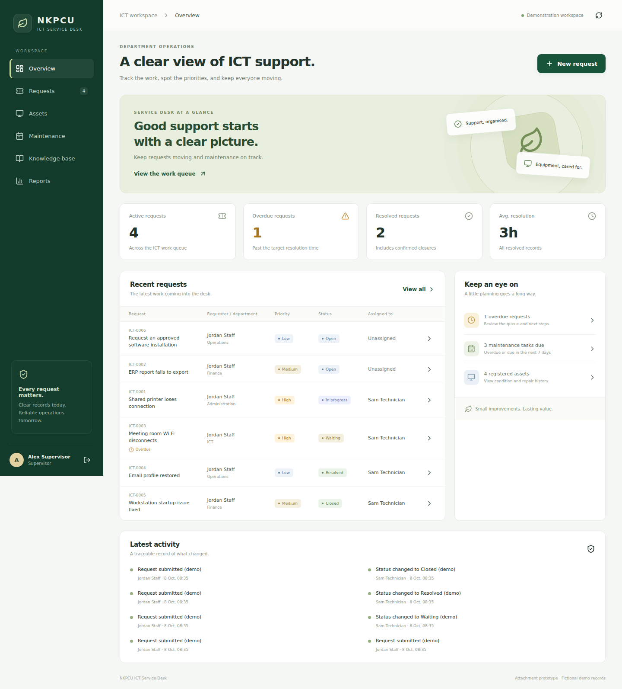

# NKPCU ICT Service Desk

A working Django + React attachment prototype for internal ICT support, equipment histories, preventive maintenance, and reviewed troubleshooting knowledge.

**Status:** functional local MVP for evaluation. It is not an official NKPCU service and is not connected to the company's ERP, staff directory, or production infrastructure. Demo accounts and records are fictional.



## What works

- Session-based sign-in with CSRF protection and Staff, Technician, and Supervisor roles.
- Staff submit and track their own ICT requests; ICT staff manage the full queue.
- Ticket categories, priorities, target times, technician assignment, progress notes, required resolution notes, requester confirmation, and reopening.
- Equipment registration and editing, condition, custodian, location, serial number, warranty date, and linked repair history.
- Downloadable QR labels that open a fault form with the device selected after sign-in.
- Scheduled maintenance and recorded completion findings.
- Searchable plain-text knowledge guides; supervisors manage drafts and publish reviewed guides.
- Dashboard counts, average resolution hours, status/category summaries, and scoped CSV exports with spreadsheet formula injection protection.
- Audit records for changes made through the app. Django admin is intended only for trusted administrators; direct admin/database edits do not create app audit events.
- Responsive layout and fictional sample records for demonstration.

## Run on Windows (PowerShell)

Install Python 3.12+ and Node.js 22.12+ first. Run these commands from the repository root. A virtual environment created on Linux cannot be reused on Windows; create a new one locally.

### Terminal 1 — backend

```powershell
cd backend
py -m venv .venv
.\.venv\Scripts\python.exe -m pip install -r requirements.txt
.\.venv\Scripts\python.exe manage.py migrate
.\.venv\Scripts\python.exe manage.py seed_demo
.\.venv\Scripts\python.exe manage.py runserver 127.0.0.1:8000
```

Using the Python executable directly avoids PowerShell activation-policy problems.

### Terminal 2 — frontend

Open another terminal at the repository root:

```powershell
cd frontend
npm.cmd ci
npm.cmd run dev
```

Open **http://localhost:5173**. Using `npm.cmd` avoids the Windows `npm.ps1` execution-policy issue.

### Demo sign-in

| Username | Role | Initial password |
| --- | --- | --- |
| `supervisor` | Supervisor | `DemoCoffee2026!` |
| `technician` | Technician | `DemoCoffee2026!` |
| `staff` | Staff | `DemoCoffee2026!` |

The seed command only sets a password when creating an account; rerunning it does not reset existing passwords. Set `DEMO_PASSWORD` before the first seed to choose a different demonstration password. Do not use demo accounts in a real deployment.

## Run on Linux/macOS

```bash
cd backend
python3 -m venv .venv
.venv/bin/python -m pip install -r requirements.txt
.venv/bin/python manage.py migrate
.venv/bin/python manage.py seed_demo
.venv/bin/python manage.py runserver 127.0.0.1:8000
```

In another terminal:

```bash
cd frontend
npm ci
npm run dev
```

## Create real pilot accounts

Use a separate database for a pilot and do not seed demonstration records. Run `python manage.py setup_roles`, then `python manage.py createsuperuser`. Sign in at http://127.0.0.1:8000/admin/ and create users; assign one application role group per user. Users without an ICT group are treated as Staff. App supervisors do not automatically receive Django admin access.

## Verification

```powershell
cd backend
.\.venv\Scripts\python.exe manage.py check
.\.venv\Scripts\python.exe manage.py test
.\.venv\Scripts\python.exe manage.py makemigrations --check --dry-run
```

```powershell
cd frontend
npm.cmd run build
```

GitHub Actions runs backend tests, migration consistency, and the frontend build on pushes and pull requests.

## Important operating details

- SQLite is the easy local default; PostgreSQL is supported using the environment variables in `backend/.env.example`. Those variables must be set in the shell or hosting environment; the example file is not auto-loaded.
- Development requests use Vite's `/api` proxy. Keep browser requests relative to the frontend origin; there is no need to disable CSRF or add broad CORS exceptions.
- Set `PUBLIC_APP_URL` to the actual address accessible by users before printing QR labels. A phone cannot access the PC through `localhost`; use a configured LAN or deployment address with matching allowed hosts and trusted origins.
- Prototype targets are elapsed hours: Critical 4, High 8, Medium 24, Low 72. Waiting requests continue to consume that time. The ICT team must agree targets before a pilot.
- Average resolution time covers currently resolved/closed records. Reopened records are excluded until resolved again. Reports currently cover all stored records.
- Login rate limiting uses a local process cache for development. Use shared-cache/proxy rate limiting for a deployment with multiple workers.
- Attachments, email/SMS delivery, SSO, automatic inventory discovery, date-filtered reports, and ERP integration are future work. No background notifications or emails are sent by this version.

## Attachment documentation

- [Proposal and scope](docs/PROJECT_PROPOSAL.md)
- [Architecture and permissions](docs/ARCHITECTURE.md)
- [School demonstration and evidence guide](docs/ATTACHMENT_DEMO.md)
- [Pilot and deployment guide](docs/PILOT_GUIDE.md)

Start by validating the support process with ICT staff, then run a small pilot. Record actual feedback and results; the software alone is not evidence of operational improvement.
