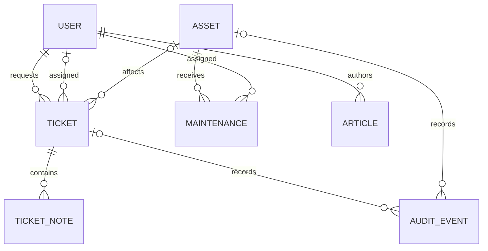
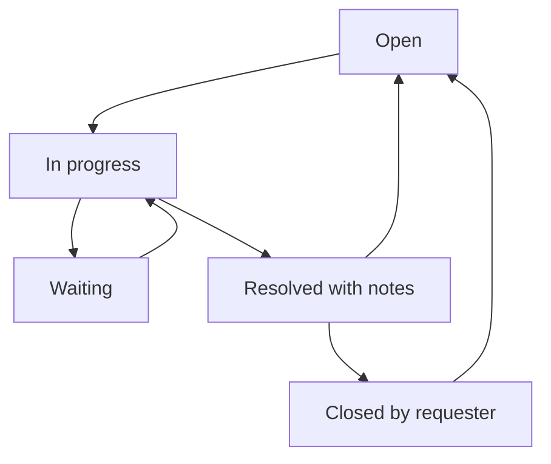

# Architecture and permissions

The React frontend uses relative `/api/` requests. Vite proxies these to Django during development. Django manages authentication, CSRF protection, validation, and persistent records. SQLite is the local default; environment variables select PostgreSQL for a pilot/deployment.

## Data relationships

## Request lifecycle

This diagram shows the usual workflow; ICT can also move an open or waiting request directly to resolved with a required resolution note. Technicians cannot directly close requests. Reopening clears the previous resolution and starts a new target window; past status events remain recorded.

## Permissions

| Operation | Staff | Technician | Supervisor |
| --- | --- | --- | --- |
| Submit a request | Yes | Yes | Yes |
| Read, discuss, reopen requests | Own | All | All |
| Assign, prioritise, resolve requests | No | Yes | Yes |
| Confirm a resolved issue and close | Own | Own | Own |
| Register/edit equipment and view full device histories | No | Yes | Yes |
| Schedule/complete maintenance | No | Yes | Yes |
| Read published guides | Yes | Yes | Yes |
| Read drafts and create/edit/publish guides | No | No | Yes |
| Dashboard and CSV reports | Own requests | All | All |

All authenticated users receive the active asset dropdown to identify affected equipment and the active ICT assignee list. The full asset inventory and history endpoints are restricted to ICT roles. A user with no ICT group is Staff; Supervisor takes precedence if multiple groups are assigned. Trusted Django superusers have Supervisor app privileges.

## Validation and audit

Django ModelForms validate submitted records and choices. The requester is taken from the authenticated session, not the request body. Request updates and their audit records use database transactions. Resolution requires a note; maintenance completion requires findings and cannot be overwritten through the app. Record relationships use protected deletes to preserve linked history.

Application audit events are not a tamper-proof compliance archive. Trusted administrators can modify the database and Django admin records; these paths do not automatically create application audit events. Use appropriate account administration and operational controls for a pilot.

## API groups

- `/api/session/`, `/api/login/`, `/api/logout/`: session lifecycle.
- `/api/bootstrap/`: current user, active assets, ICT assignees.
- `/api/tickets/`, `/api/tickets/{id}/`, `/api/tickets/{id}/notes/`: requests and discussion.
- `/api/assets/`, `/api/assets/{id}/`, `/api/assets/{id}/qr/`: asset registry, histories, labels.
- `/api/maintenance/`, `/api/maintenance/{id}/`: schedule and completion.
- `/api/articles/`, `/api/articles/{id}/`: guides.
- `/api/dashboard/`, `/api/reports/tickets.csv`: summary and export.
